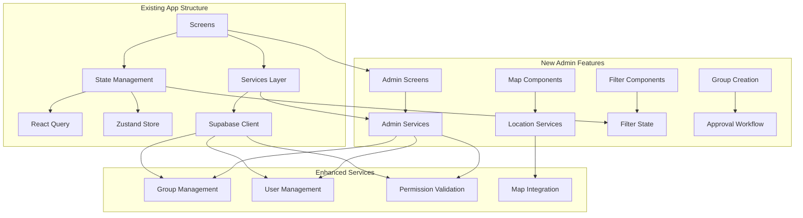
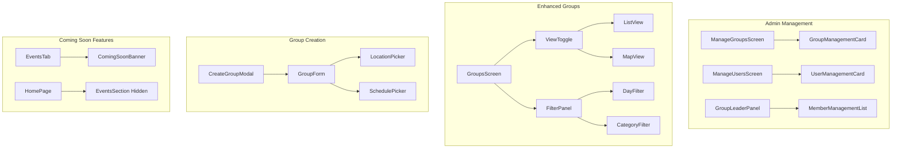

# Design Document

## Overview

The admin features for VineMe extend the existing mobile application with comprehensive management capabilities for church administrators and group leaders. The design builds upon the current architecture while adding new screens, services, and components to support role-based administration, group management, user oversight, and enhanced group discovery through map views and filtering.

The implementation follows the existing patterns established in the VineMe codebase, utilizing the same technology stack (Expo, TypeScript, React Native) and architectural principles (services layer, React Query, Zustand stores) while adding new administrative interfaces and enhanced user experiences.

## Architecture

### High-Level Architecture Extension



### New Components Architecture



## Components and Interfaces

### Admin Management Components

#### ManageGroupsScreen
- **Purpose**: Church admin interface for managing all groups in their church
- **Features**: 
  - List all groups with status indicators (pending, approved, denied, closed)
  - Approve/decline pending group requests
  - Close existing groups
  - View group members and details
- **Permissions**: Requires `church_admin` role

#### ManageUsersScreen
- **Purpose**: Church admin interface for user oversight
- **Features**:
  - List all church members
  - Filter by group participation status
  - View user group memberships
  - Identify unconnected users
- **Permissions**: Requires `church_admin` role

#### GroupLeaderPanel
- **Purpose**: Group leader interface for managing their specific groups
- **Features**:
  - Edit group details
  - Manage member roles (promote/demote)
  - Handle join requests
  - Contact potential members
- **Permissions**: Requires `leader` role in specific group

### Enhanced Groups Components

#### ViewToggle
- **Purpose**: Switch between list and map views
- **Implementation**: Toggle buttons with state management
- **States**: `list` | `map`

#### MapView
- **Purpose**: Display groups as interactive map pins
- **Features**:
  - Interactive map with group location pins
  - Tap pins to show group summary popup
  - Navigate to full group details
  - Apply filters to map display
- **Technology**: React Native Maps or similar mapping library

#### FilterPanel
- **Purpose**: Filter groups by various criteria
- **Filters**:
  - Meeting day of week
  - Group category/type
  - Distance (for map view)
- **State**: Managed through Zustand store

### Group Creation Components

#### CreateGroupModal
- **Purpose**: Allow users to create new group requests
- **Features**:
  - Multi-step form for group details
  - Location selection with map picker
  - Schedule selection
  - Automatic creator as leader
  - Submit for admin approval

#### GroupRequestCard
- **Purpose**: Display pending group requests for admin review
- **Features**:
  - Group details summary
  - Creator information
  - Approve/decline actions
  - Request timestamp

### Coming Soon Components

#### ComingSoonBanner
- **Purpose**: Indicate events features are not yet available
- **Implementation**: Overlay banner on events tab
- **Features**:
  - Visual indicator
  - Prevent navigation
  - Informational message

## Data Models

### Extended Group Model

```typescript
interface GroupWithAdminDetails extends GroupWithDetails {
  creator_id?: string;
  creator?: User;
  pending_requests?: GroupJoinRequest[];
  approval_history?: GroupApprovalHistory[];
}

interface GroupJoinRequest {
  id: string;
  group_id: string;
  user_id: string;
  user?: User;
  contact_consent: boolean;
  message?: string;
  status: 'pending' | 'approved' | 'declined';
  created_at: string;
}

interface GroupApprovalHistory {
  id: string;
  group_id: string;
  admin_id: string;
  admin?: User;
  action: 'approved' | 'declined' | 'closed';
  reason?: string;
  created_at: string;
}
```

### User Management Model

```typescript
interface UserWithGroupStatus extends UserWithDetails {
  group_count: number;
  is_connected: boolean;
  last_activity?: string;
  pending_requests?: GroupJoinRequest[];
}

interface ChurchUserSummary {
  total_users: number;
  connected_users: number;
  unconnected_users: number;
  active_groups: number;
  pending_requests: number;
}
```

### Filter State Model

```typescript
interface GroupFilters {
  meetingDay?: string[];
  category?: string[];
  distance?: number;
  searchQuery?: string;
}

interface MapState {
  region: {
    latitude: number;
    longitude: number;
    latitudeDelta: number;
    longitudeDelta: number;
  };
  selectedGroup?: string;
}
```

## Service Layer Extensions

### Admin Services

#### GroupAdminService
```typescript
class GroupAdminService {
  async getChurchGroups(churchId: string, includeAll?: boolean): Promise<GroupWithAdminDetails[]>
  async approveGroup(groupId: string, adminId: string): Promise<void>
  async declineGroup(groupId: string, adminId: string, reason?: string): Promise<void>
  async closeGroup(groupId: string, adminId: string, reason?: string): Promise<void>
  async getGroupRequests(groupId: string): Promise<GroupJoinRequest[]>
  async approveJoinRequest(requestId: string): Promise<void>
  async declineJoinRequest(requestId: string): Promise<void>
}
```

#### UserAdminService
```typescript
class UserAdminService {
  async getChurchUsers(churchId: string): Promise<UserWithGroupStatus[]>
  async getUnconnectedUsers(churchId: string): Promise<UserWithGroupStatus[]>
  async getUserGroupHistory(userId: string): Promise<GroupMembership[]>
  async getChurchSummary(churchId: string): Promise<ChurchUserSummary>
}
```

#### GroupCreationService
```typescript
class GroupCreationService {
  async createGroupRequest(groupData: CreateGroupData, creatorId: string): Promise<Group>
  async updateGroupDetails(groupId: string, updates: UpdateGroupData, userId: string): Promise<Group>
  async promoteToLeader(groupId: string, userId: string, promoterId: string): Promise<void>
  async demoteFromLeader(groupId: string, userId: string, demoterId: string): Promise<void>
}
```

### Enhanced Location Services

#### LocationService
```typescript
class LocationService {
  async geocodeAddress(address: string): Promise<Coordinates>
  async reverseGeocode(coordinates: Coordinates): Promise<Address>
  async calculateDistance(from: Coordinates, to: Coordinates): Promise<number>
  async getGroupsInRadius(center: Coordinates, radius: number): Promise<GroupWithDetails[]>
}
```

## Error Handling

### Admin-Specific Error Handling

#### Permission Errors
- **Insufficient Role**: Clear messaging when user lacks required admin role
- **Resource Access**: Specific errors for church-scoped data access
- **Action Restrictions**: Detailed feedback for restricted administrative actions

#### Group Management Errors
- **Approval Conflicts**: Handle cases where group status changes during admin review
- **Member Management**: Errors for invalid role changes or membership conflicts
- **Creation Limits**: Handle church-specific group creation limits

#### Map and Location Errors
- **Location Services**: Graceful degradation when location services unavailable
- **Geocoding Failures**: Fallback to manual location entry
- **Map Loading**: Loading states and retry mechanisms for map components

### Error Recovery Strategies

#### Optimistic Updates
- **Admin Actions**: Immediate UI updates with rollback on failure
- **Group Status**: Visual feedback during approval/decline processes
- **Member Management**: Instant role changes with error recovery

#### Offline Handling
- **Admin Cache**: Cache admin data for offline viewing
- **Sync Conflicts**: Handle conflicts when admin actions sync after reconnection
- **Map Caching**: Cache map tiles and group locations for offline use

## Testing Strategy

### Admin Feature Testing

#### Unit Tests
- **Admin Services**: Test all administrative service methods
- **Permission Logic**: Comprehensive permission checking tests
- **Group Management**: Test group creation, approval, and management workflows
- **User Management**: Test user oversight and filtering functionality

#### Integration Tests
- **Admin Workflows**: End-to-end admin task completion
- **Role-Based Access**: Test permission enforcement across admin features
- **Group Lifecycle**: Test complete group creation to closure workflow
- **Map Integration**: Test map view functionality and location services

#### E2E Tests
- **Church Admin Journey**: Complete admin workflow testing
- **Group Leader Journey**: Test group leader management capabilities
- **Group Creation Flow**: Test user group creation and approval process
- **Map and Filter Usage**: Test enhanced group discovery features

### Performance Testing

#### Admin Dashboard Performance
- **Large Data Sets**: Test admin screens with many groups/users
- **Real-time Updates**: Test live updates for admin notifications
- **Concurrent Admin Actions**: Test multiple admins working simultaneously

#### Map Performance
- **Many Pins**: Test map performance with numerous group locations
- **Filter Performance**: Test filtering large numbers of groups
- **Location Services**: Test location accuracy and performance

## Security Considerations

### Role-Based Security

#### Permission Enforcement
- **Server-Side Validation**: All admin actions validated on server
- **RLS Policies**: Enhanced Row Level Security for admin data
- **Audit Logging**: Track all administrative actions for accountability

#### Data Access Controls
- **Church Scoping**: Strict enforcement of church-based data access
- **Group Leadership**: Verify group leader permissions for management actions
- **User Privacy**: Protect user data in admin interfaces

### Admin Action Security

#### Approval Workflows
- **Double Confirmation**: Require confirmation for destructive admin actions
- **Reason Tracking**: Log reasons for group approvals/denials
- **Reversibility**: Allow reversal of certain admin actions where appropriate

#### Contact Information
- **Consent Management**: Respect user consent for contact information sharing
- **Data Minimization**: Only share necessary contact details with group leaders
- **Privacy Controls**: Allow users to control their contact visibility

## Performance Optimization

### Admin Interface Optimization

#### Data Loading
- **Pagination**: Implement pagination for large admin data sets
- **Lazy Loading**: Load admin details on demand
- **Caching Strategy**: Cache frequently accessed admin data

#### Real-time Updates
- **WebSocket Integration**: Real-time updates for admin notifications
- **Optimistic Updates**: Immediate UI feedback for admin actions
- **Background Sync**: Sync admin data in background

### Map Performance

#### Map Rendering
- **Clustering**: Group nearby pins to improve performance
- **Viewport Loading**: Only load groups visible in current map view
- **Tile Caching**: Cache map tiles for offline use

#### Location Services
- **Debounced Geocoding**: Prevent excessive geocoding API calls
- **Location Caching**: Cache geocoded locations
- **Fallback Strategies**: Manual location entry when geocoding fails

## Accessibility

### Admin Interface Accessibility

#### Screen Reader Support
- **Admin Actions**: Clear labels for all administrative actions
- **Status Indicators**: Accessible status indicators for groups and users
- **Navigation**: Clear navigation structure for admin screens

#### Visual Accessibility
- **Status Colors**: Use color and text for status indicators
- **High Contrast**: Ensure admin interfaces meet contrast requirements
- **Font Scaling**: Support dynamic font sizing in admin screens

### Map Accessibility

#### Alternative Access
- **List Fallback**: Always provide list view as alternative to map
- **Location Descriptions**: Text descriptions of group locations
- **Keyboard Navigation**: Support keyboard navigation for map interactions

## Implementation Phases

### Phase 1: Core Admin Features
1. **Admin Services**: Implement group and user admin services
2. **Permission System**: Enhance permission checking for admin roles
3. **Basic Admin Screens**: Create manage groups and manage users screens
4. **Group Status Management**: Implement approval/decline workflows

### Phase 2: Group Leader Features
1. **Group Management**: Implement group leader management capabilities
2. **Member Management**: Add promote/demote functionality
3. **Join Request Handling**: Implement request approval system
4. **Contact Integration**: Add contact sharing features

### Phase 3: Enhanced Group Discovery
1. **Map Integration**: Add map view to groups screen
2. **Filter System**: Implement group filtering
3. **Location Services**: Add geocoding and location features
4. **Group Creation**: Implement user group creation workflow

### Phase 4: Coming Soon Features
1. **Events Disabling**: Add coming soon banners and disable events
2. **UI Adjustments**: Hide events content from home screen
3. **Profile Updates**: Hide manage events button
4. **Messaging**: Add clear coming soon messaging

### Phase 5: Polish and Optimization
1. **Performance Optimization**: Optimize admin interfaces and map performance
2. **Error Handling**: Comprehensive error handling and recovery
3. **Testing**: Complete testing suite for all admin features
4. **Documentation**: User guides for admin features