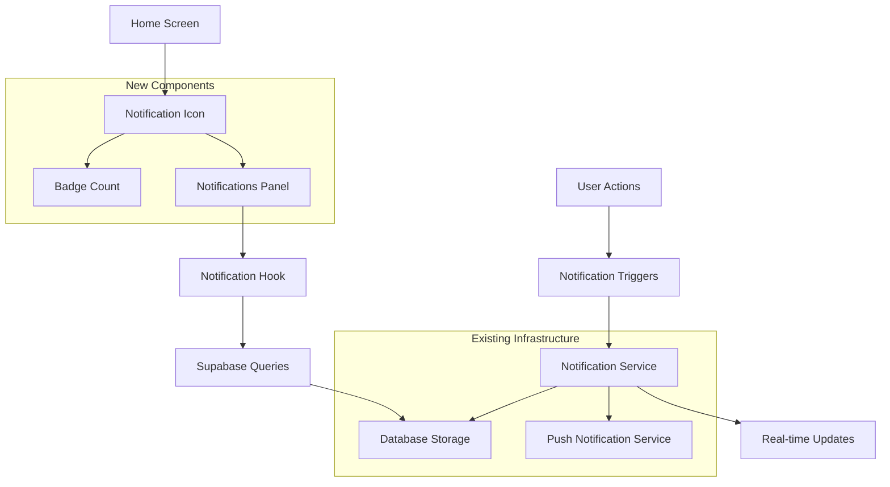

# Enhanced Notifications System Design

## Overview

The enhanced notifications system builds upon the existing notification infrastructure in the VineMe app to provide comprehensive, real-time notifications for key user interactions. The system will integrate seamlessly with the current Supabase backend, React Native frontend, and existing notification services while adding new triggers, a dedicated notifications panel, and improved user experience.

## Architecture

### High-Level Architecture



### System Components

1. **Enhanced Notification Service** - Extends existing `src/services/notifications.ts`
2. **Notification Triggers** - New trigger functions for specific user actions
3. **Notifications Panel** - New UI component for viewing notifications
4. **Notification Icon & Badge** - Header component with unread count
5. **Database Schema** - Enhanced notification table structure
6. **Real-time Subscriptions** - Supabase real-time listeners for live updates

## Components and Interfaces

### 1. Database Schema Enhancement

#### Enhanced Notifications Table
```sql
-- Extend existing notifications table or create if not exists
CREATE TABLE IF NOT EXISTS notifications (
  id UUID PRIMARY KEY DEFAULT gen_random_uuid(),
  user_id UUID NOT NULL REFERENCES users(id) ON DELETE CASCADE,
  type TEXT NOT NULL CHECK (type IN (
    'friend_request_received',
    'friend_request_accepted',
    'group_request_submitted',
    'group_request_approved',
    'group_request_denied',
    'join_request_received',
    'join_request_approved',
    'join_request_denied',
    'group_member_added',
    'referral_accepted',
    'referral_joined_group',
    'event_reminder'
  )),
  title TEXT NOT NULL,
  body TEXT NOT NULL,
  data JSONB DEFAULT '{}',
  read BOOLEAN DEFAULT FALSE,
  read_at TIMESTAMP WITH TIME ZONE,
  action_url TEXT,
  expires_at TIMESTAMP WITH TIME ZONE,
  created_at TIMESTAMP WITH TIME ZONE DEFAULT NOW(),
  updated_at TIMESTAMP WITH TIME ZONE DEFAULT NOW()
);

-- Indexes for performance
CREATE INDEX IF NOT EXISTS idx_notifications_user_id ON notifications(user_id);
CREATE INDEX IF NOT EXISTS idx_notifications_read ON notifications(user_id, read);
CREATE INDEX IF NOT EXISTS idx_notifications_created_at ON notifications(created_at DESC);
CREATE INDEX IF NOT EXISTS idx_notifications_type ON notifications(type);
```

#### User Notification Settings Table
```sql
-- Enhanced notification preferences
CREATE TABLE IF NOT EXISTS user_notification_settings (
  id UUID PRIMARY KEY DEFAULT gen_random_uuid(),
  user_id UUID NOT NULL REFERENCES users(id) ON DELETE CASCADE UNIQUE,
  friend_requests BOOLEAN DEFAULT TRUE,
  friend_request_accepted BOOLEAN DEFAULT TRUE,
  group_requests BOOLEAN DEFAULT TRUE,
  group_request_responses BOOLEAN DEFAULT TRUE,
  join_requests BOOLEAN DEFAULT TRUE,
  join_request_responses BOOLEAN DEFAULT TRUE,
  referral_updates BOOLEAN DEFAULT TRUE,
  event_reminders BOOLEAN DEFAULT TRUE,
  push_notifications BOOLEAN DEFAULT TRUE,
  email_notifications BOOLEAN DEFAULT FALSE,
  created_at TIMESTAMP WITH TIME ZONE DEFAULT NOW(),
  updated_at TIMESTAMP WITH TIME ZONE DEFAULT NOW()
);
```

### 2. Enhanced Notification Service

#### New Notification Types Interface
```typescript
export interface NotificationTriggerData {
  // Friend request notifications
  friendRequest: {
    fromUserId: string;
    toUserId: string;
    fromUserName: string;
  };
  
  friendRequestAccepted: {
    acceptedByUserId: string;
    acceptedByUserName: string;
    originalRequesterId: string;
  };
  
  // Group request notifications
  groupRequestSubmitted: {
    groupId: string;
    groupTitle: string;
    creatorId: string;
    creatorName: string;
    churchId: string;
  };
  
  groupRequestApproved: {
    groupId: string;
    groupTitle: string;
    leaderId: string;
    approvedByName: string;
  };
  
  groupRequestDenied: {
    groupId: string;
    groupTitle: string;
    leaderId: string;
    deniedByName: string;
    reason?: string;
  };
  
  // Join request notifications
  joinRequestReceived: {
    groupId: string;
    groupTitle: string;
    requesterId: string;
    requesterName: string;
    leaderIds: string[];
  };
  
  joinRequestApproved: {
    groupId: string;
    groupTitle: string;
    requesterId: string;
    approvedByName: string;
  };
  
  joinRequestDenied: {
    groupId: string;
    groupTitle: string;
    requesterId: string;
    deniedByName: string;
  };
  
  // Referral notifications
  referralAccepted: {
    referrerId: string;
    referredUserId: string;
    referredUserName: string;
  };
  
  referralJoinedGroup: {
    referrerId: string;
    referredUserId: string;
    referredUserName: string;
    groupId: string;
    groupTitle: string;
  };
}
```

#### Enhanced Notification Service Methods
```typescript
export interface EnhancedNotificationService {
  // Trigger methods for each notification type
  triggerFriendRequestNotification(data: NotificationTriggerData['friendRequest']): Promise<void>;
  triggerFriendRequestAcceptedNotification(data: NotificationTriggerData['friendRequestAccepted']): Promise<void>;
  triggerGroupRequestNotification(data: NotificationTriggerData['groupRequestSubmitted']): Promise<void>;
  triggerGroupRequestResponseNotification(data: NotificationTriggerData['groupRequestApproved'] | NotificationTriggerData['groupRequestDenied']): Promise<void>;
  triggerJoinRequestNotification(data: NotificationTriggerData['joinRequestReceived']): Promise<void>;
  triggerJoinRequestResponseNotification(data: NotificationTriggerData['joinRequestApproved'] | NotificationTriggerData['joinRequestDenied']): Promise<void>;
  triggerReferralNotification(data: NotificationTriggerData['referralAccepted'] | NotificationTriggerData['referralJoinedGroup']): Promise<void>;
  
  // Batch operations
  createNotifications(notifications: CreateNotificationInput[]): Promise<void>;
  markNotificationsAsRead(notificationIds: string[]): Promise<void>;
  deleteNotifications(notificationIds: string[]): Promise<void>;
  
  // Real-time subscriptions
  subscribeToUserNotifications(userId: string, callback: (notification: Notification) => void): () => void;
}
```

### 3. Notifications Panel Component

#### NotificationsPanel Component
```typescript
interface NotificationsPanelProps {
  visible: boolean;
  onClose: () => void;
  userId: string;
}

interface NotificationItemProps {
  notification: Notification;
  onPress: (notification: Notification) => void;
  onMarkAsRead: (notificationId: string) => void;
  onDelete: (notificationId: string) => void;
}
```

#### Panel Features
- **Slide-up modal** presentation from bottom of screen
- **Pull-to-refresh** functionality
- **Infinite scroll** with pagination
- **Swipe actions** for mark as read/delete
- **Empty state** with helpful messaging
- **Loading states** and error handling
- **Accessibility** support with proper labels and navigation

### 4. Notification Icon & Badge Component

#### NotificationIconWithBadge Component
```typescript
interface NotificationIconWithBadgeProps {
  onPress: () => void;
  unreadCount: number;
  size?: number;
  color?: string;
  badgeColor?: string;
}
```

#### Integration Points
- **Home screen header** - Top right position
- **Tab bar badge** - Optional secondary location
- **Real-time updates** - Badge count updates automatically
- **Animation** - Subtle bounce when new notifications arrive

## Data Models

### Enhanced Notification Model
```typescript
export interface Notification {
  id: string;
  user_id: string;
  type: NotificationType;
  title: string;
  body: string;
  data: Record<string, any>;
  read: boolean;
  read_at?: string;
  action_url?: string;
  expires_at?: string;
  created_at: string;
  updated_at: string;
}

export type NotificationType = 
  | 'friend_request_received'
  | 'friend_request_accepted'
  | 'group_request_submitted'
  | 'group_request_approved'
  | 'group_request_denied'
  | 'join_request_received'
  | 'join_request_approved'
  | 'join_request_denied'
  | 'group_member_added'
  | 'referral_accepted'
  | 'referral_joined_group'
  | 'event_reminder';

export interface NotificationSettings {
  id: string;
  user_id: string;
  friend_requests: boolean;
  friend_request_accepted: boolean;
  group_requests: boolean;
  group_request_responses: boolean;
  join_requests: boolean;
  join_request_responses: boolean;
  referral_updates: boolean;
  event_reminders: boolean;
  push_notifications: boolean;
  email_notifications: boolean;
  created_at: string;
  updated_at: string;
}
```

### Notification Aggregation Models
```typescript
export interface NotificationGroup {
  type: NotificationType;
  count: number;
  latestNotification: Notification;
  notifications: Notification[];
}

export interface NotificationSummary {
  totalUnread: number;
  unreadByType: Record<NotificationType, number>;
  recentNotifications: Notification[];
  groupedNotifications: NotificationGroup[];
}
```

## Error Handling

### Error Scenarios and Responses

1. **Network Connectivity Issues**
   - Queue notifications locally when offline
   - Sync when connectivity returns
   - Show offline indicator in notifications panel

2. **Push Notification Permission Denied**
   - Gracefully degrade to in-app notifications only
   - Provide settings link to enable permissions
   - Show informational banner about reduced functionality

3. **Database Errors**
   - Retry failed notification creation with exponential backoff
   - Log errors for monitoring and debugging
   - Show user-friendly error messages

4. **Real-time Subscription Failures**
   - Implement automatic reconnection logic
   - Fall back to polling for critical notifications
   - Maintain notification state consistency

### Error Recovery Strategies

```typescript
export interface NotificationErrorHandler {
  handleNetworkError(error: Error, operation: string): Promise<void>;
  handlePermissionError(error: Error): Promise<void>;
  handleDatabaseError(error: Error, notification: Notification): Promise<void>;
  handleRealtimeError(error: Error, userId: string): Promise<void>;
}
```

## Testing Strategy

### Unit Testing
- **Notification service methods** - Test all trigger functions
- **Database operations** - Test CRUD operations and queries
- **Notification formatting** - Test message generation and data handling
- **Error handling** - Test error scenarios and recovery

### Integration Testing
- **End-to-end notification flow** - From trigger to delivery
- **Real-time updates** - Test Supabase subscriptions
- **Cross-component communication** - Test service-to-UI data flow
- **Permission handling** - Test notification permission flows

### User Experience Testing
- **Notification panel interactions** - Test all user actions
- **Performance** - Test with large notification volumes
- **Accessibility** - Test with screen readers and keyboard navigation
- **Cross-platform** - Test on iOS and Android devices

### Test Data Setup
```typescript
export interface NotificationTestData {
  createMockNotification(type: NotificationType, overrides?: Partial<Notification>): Notification;
  createMockUser(overrides?: Partial<User>): User;
  createMockGroup(overrides?: Partial<Group>): Group;
  setupNotificationScenario(scenario: 'friend_request' | 'group_approval' | 'join_request'): Promise<void>;
}
```

## Performance Considerations

### Optimization Strategies

1. **Database Query Optimization**
   - Use proper indexes for notification queries
   - Implement pagination for large notification lists
   - Cache frequently accessed notification counts

2. **Real-time Updates**
   - Use Supabase row-level security for efficient filtering
   - Implement connection pooling for real-time subscriptions
   - Debounce rapid notification updates

3. **Mobile Performance**
   - Lazy load notification details
   - Implement virtual scrolling for large lists
   - Optimize image loading for notification avatars

4. **Push Notification Efficiency**
   - Batch similar notifications to reduce noise
   - Implement intelligent notification scheduling
   - Use notification channels for better organization

### Monitoring and Analytics

```typescript
export interface NotificationAnalytics {
  trackNotificationSent(type: NotificationType, userId: string): void;
  trackNotificationOpened(notificationId: string, userId: string): void;
  trackNotificationDismissed(notificationId: string, userId: string): void;
  trackPanelOpened(userId: string): void;
  trackSettingsChanged(userId: string, settings: Partial<NotificationSettings>): void;
}
```

## Security Considerations

### Data Protection
- **User privacy** - Only show notifications to intended recipients
- **Data encryption** - Encrypt sensitive notification data
- **Access control** - Implement proper row-level security policies
- **Audit logging** - Track notification access and modifications

### Supabase Row-Level Security Policies
```sql
-- Users can only see their own notifications
CREATE POLICY "Users can view own notifications" ON notifications
  FOR SELECT USING (auth.uid() = user_id);

-- Users can only update their own notifications (mark as read)
CREATE POLICY "Users can update own notifications" ON notifications
  FOR UPDATE USING (auth.uid() = user_id);

-- Only system can insert notifications
CREATE POLICY "System can insert notifications" ON notifications
  FOR INSERT WITH CHECK (true);
```

### Input Validation
- **Notification content** - Sanitize user-generated content
- **Action URLs** - Validate and whitelist allowed navigation targets
- **User permissions** - Verify user has permission to trigger notifications

## Integration Points

### Existing Service Integration

1. **Authentication Service** - User context for notifications
2. **Groups Service** - Group-related notification triggers
3. **Friendships Service** - Friend request notification triggers
4. **Admin Service** - Admin approval notification triggers
5. **Referrals Service** - Referral success notification triggers

### Navigation Integration

```typescript
export interface NotificationNavigationHandler {
  handleNotificationPress(notification: Notification): void;
  getNavigationTarget(notification: Notification): string;
  validateNavigationPermissions(notification: Notification, user: User): boolean;
}
```

### Theme Integration
- Use existing theme system for consistent styling
- Support light/dark mode for notification panel
- Implement theme-aware notification badge colors
- Ensure accessibility compliance with theme colors

This design provides a comprehensive foundation for implementing the enhanced notifications system while maintaining consistency with the existing VineMe app architecture and user experience patterns.