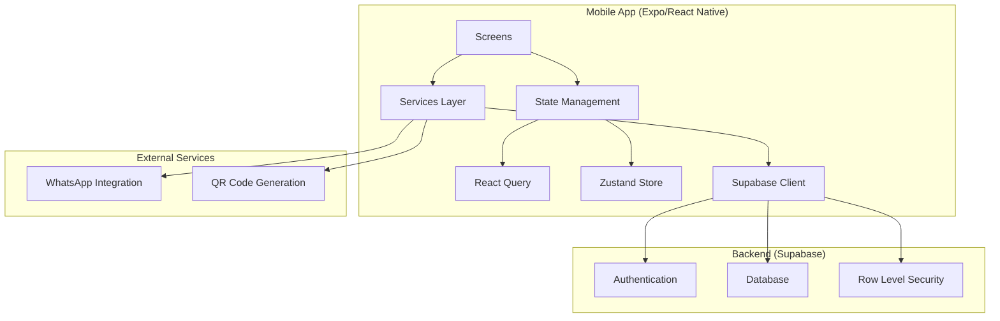

# Design Document

## Overview

VineMe is a cross-platform mobile application built with Expo (managed workflow), TypeScript, and React Native. The app connects church members to Bible study groups and community events through an intuitive mobile interface. The architecture follows modern React Native patterns with clear separation of concerns, leveraging an existing Supabase database for backend services.

The design emphasizes maintainability, scalability, and user experience while providing a solid foundation for future feature development. The app uses a tab-based navigation structure with four main sections: Home, Groups, Events, and Profile.

## Architecture

### High-Level Architecture



### Technology Stack

- **Framework**: Expo (managed workflow) with TypeScript
- **Navigation**: Expo Router with file-based routing
- **State Management**:
  - React Query for server state (caching, synchronization)
  - Zustand for UI state (local state management)
- **Backend**: Supabase (existing database and authentication)
- **Styling**: React Native StyleSheet with consistent design tokens
- **Development Tools**: ESLint, Prettier, absolute imports

### Project Structure

```
src/
├── app/                    # Expo Router pages
│   ├── (auth)/            # Authentication screens
│   ├── (tabs)/            # Main tab navigation
│   └── _layout.tsx        # Root layout
├── components/            # Reusable UI components
│   ├── ui/               # Basic UI components
│   └── forms/            # Form components
├── services/             # Data access layer
│   ├── auth.ts           # Authentication services
│   ├── groups.ts         # Group-related services
│   ├── events.ts         # Event-related services
│   ├── users.ts          # User profile services
│   └── supabase.ts       # Supabase client configuration
├── stores/               # Zustand stores
│   ├── auth.ts           # Authentication state
│   └── ui.ts             # UI state (loading, modals, etc.)
├── types/                # TypeScript type definitions
│   ├── database.ts       # Database schema types
│   └── app.ts            # App-specific types
├── utils/                # Utility functions
│   ├── constants.ts      # App constants
│   └── helpers.ts        # Helper functions
└── hooks/                # Custom React hooks
    ├── useAuth.ts        # Authentication hook
    └── queries/          # React Query hooks
        ├── useGroups.ts
        ├── useEvents.ts
        └── useUsers.ts
```

## Components and Interfaces

### Core Components

#### Authentication Components

- **AuthScreen**: Main authentication interface with sign-in/sign-up toggle
- **OnboardingFlow**: Multi-step onboarding process
  - Step 1: Name input
  - Step 2: Church selection
  - Step 3: Interests selection (multi-select)
  - Step 4: Preferred meeting night selection

#### Navigation Components

- **TabLayout**: Main tab navigation container
- **TabBar**: Custom tab bar with icons and labels

#### List Components

- **GroupCard**: Displays group information in list view
- **EventCard**: Displays event information with date/time
- **UserCard**: Displays user profile information
- **FriendRequestCard**: Shows pending friend requests

#### Detail Components

- **GroupDetail**: Full group information with join/leave actions
- **EventDetail**: Complete event details with registration
- **ProfileDetail**: User profile with edit capabilities

### Data Interfaces

#### Database Types (Generated from Supabase Schema)

```typescript
interface User {
  id: string;
  name: string;
  email: string;
  church_id?: string;
  avatar_url?: string;
  service_id?: string;
  roles: string[];
  created_at: string;
}

interface Group {
  id: string;
  title: string;
  description: string;
  meeting_day: string;
  meeting_time: string;
  location: any; // JSONB
  whatsapp_link?: string;
  image_url?: string;
  service_id: string;
  church_id: string[];
  status: 'pending' | 'approved' | 'denied' | 'closed';
  created_at: string;
}

interface Event {
  id: string;
  title: string;
  description: string;
  church_id?: string;
  host_id: string;
  category: string;
  start_date: string;
  end_date?: string;
  location: any; // JSONB
  image_url?: string;
  price?: number;
  requires_ticket: boolean;
  is_public: boolean;
  created_at: string;
}
```

#### Service Layer Interfaces

```typescript
interface AuthService {
  signIn(email: string, password: string): Promise<AuthResponse>;
  signUp(email: string, password: string): Promise<AuthResponse>;
  signOut(): Promise<void>;
  getCurrentUser(): Promise<User | null>;
}

interface GroupService {
  getGroups(churchId: string): Promise<Group[]>;
  getGroupById(id: string): Promise<Group>;
  joinGroup(groupId: string, userId: string): Promise<void>;
  leaveGroup(groupId: string, userId: string): Promise<void>;
}
```

## Data Models

### User Management

- **Authentication**: Handled by Supabase Auth with email/password
- **Profile Data**: Stored in `users` table with foreign key to `auth.users`
- **Onboarding Data**: Name and church_id saved to database, interests and preferred meeting night stored client-side initially

### Group Management

- **Group Discovery**: Query groups by church_id with service and church joins
- **Membership**: Managed through `group_memberships` table with role-based access
- **Group Details**: Include meeting information, location, and communication links

### Event Management

- **Event Listing**: Display events by church with category and host information
- **Ticketing**: Optional ticket system with QR code generation
- **Registration**: Create ticket records for event attendance tracking

### Social Features

- **Friendships**: Bidirectional relationship management with status tracking
- **Group Referrals**: Allow members to invite non-members to groups

## Error Handling

### Network Error Handling

- **Connection Issues**: Graceful degradation with offline indicators
- **Timeout Handling**: Retry mechanisms with exponential backoff
- **API Errors**: User-friendly error messages with actionable guidance

### Authentication Errors

- **Invalid Credentials**: Clear feedback for sign-in failures
- **Session Expiry**: Automatic token refresh with fallback to re-authentication
- **Permission Errors**: Appropriate messaging for insufficient access rights

### Data Validation

- **Form Validation**: Client-side validation with real-time feedback
- **Schema Validation**: Type-safe data handling with TypeScript
- **Database Constraints**: Handle foreign key and unique constraint violations

### Error Boundaries

- **Screen-Level**: Catch and display errors within specific screens
- **Global Handler**: Fallback error handling for unexpected crashes
- **Logging**: Error tracking for debugging and monitoring

## Testing Strategy

### Unit Testing

- **Services Layer**: Test all Supabase service functions
- **Utility Functions**: Test helper functions and data transformations
- **Custom Hooks**: Test React Query hooks and Zustand stores
- **Components**: Test component rendering and user interactions

### Integration Testing

- **Authentication Flow**: Test complete sign-in/sign-up process
- **Data Flow**: Test service layer integration with React Query
- **Navigation**: Test screen transitions and deep linking
- **State Management**: Test state synchronization between stores

### End-to-End Testing

- **User Journeys**: Test complete user workflows
  - New user onboarding
  - Group discovery and joining
  - Event registration
  - Profile management
- **Cross-Platform**: Test on both iOS and Android platforms
- **Performance**: Test app performance under various conditions

### Testing Tools

- **Jest**: Unit and integration testing framework
- **React Native Testing Library**: Component testing utilities
- **Detox**: End-to-end testing for React Native
- **Mock Service Worker**: API mocking for testing

## Security Considerations

### Authentication Security

- **Secure Storage**: Use Expo SecureStore for sensitive data
- **Token Management**: Automatic token refresh and secure storage
- **Biometric Authentication**: Optional biometric sign-in for convenience

### Data Security

- **Row Level Security**: Leverage Supabase RLS policies
- **Input Sanitization**: Validate and sanitize all user inputs
- **Permission Checks**: Verify user permissions before data operations

### Privacy Protection

- **Data Minimization**: Only collect necessary user information
- **Consent Management**: Clear privacy policy and data usage consent
- **Secure Communication**: HTTPS for all API communications

## Performance Optimization

### Data Loading

- **Lazy Loading**: Load data on-demand to reduce initial load time
- **Pagination**: Implement pagination for large data sets
- **Caching Strategy**: Use React Query for intelligent caching
- **Optimistic Updates**: Immediate UI updates with background synchronization

### Image Handling

- **Image Optimization**: Compress and resize images appropriately
- **Lazy Loading**: Load images as they come into view
- **Caching**: Cache images locally to reduce network requests

### Bundle Optimization

- **Code Splitting**: Split code by routes and features
- **Tree Shaking**: Remove unused code from bundles
- **Asset Optimization**: Optimize images and other static assets

## Accessibility

### Screen Reader Support

- **Semantic Labels**: Proper accessibility labels for all interactive elements
- **Navigation**: Clear navigation structure for screen readers
- **Content Description**: Descriptive text for images and icons

### Visual Accessibility

- **Color Contrast**: Ensure sufficient contrast ratios
- **Font Scaling**: Support dynamic font sizing
- **Focus Indicators**: Clear focus indicators for keyboard navigation

### Motor Accessibility

- **Touch Targets**: Minimum 44pt touch targets
- **Gesture Alternatives**: Provide alternatives to complex gestures
- **Voice Control**: Support for voice control features
